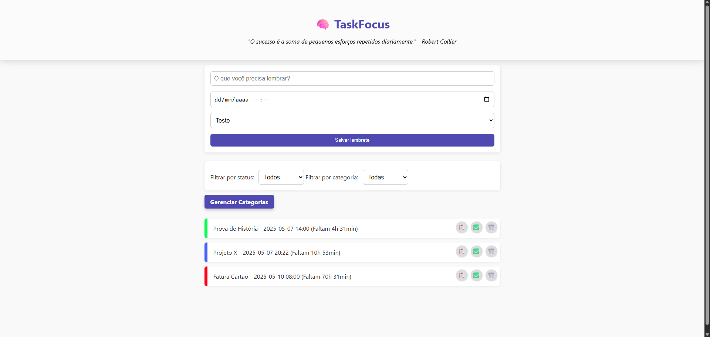

# TaskFocus 🧠✨

Um mini-aplicativo feito para ajudar as pessoas a lembrarem das suas tarefas e se manterem motivadas!

## 🔍 Visão Geral

- 📅 Criação de lembretes com data, hora e categoria personalizada
- ⏳ Contador regressivo com detecção de urgência visual
- 🧠 Frase motivacional ao abrir a aplicação
- 🔔 Notificações automáticas no momento exato do lembrete
- 📋 Botões para copiar, concluir ou excluir lembretes
- 🔍 Filtros por status e categoria
- 🖌️ Cores personalizadas por categoria
- 🎵 Alerta sonoro com áudio próprio (`alerta.mp3`)
- 💾 Dados salvos no `localStorage` 

## 🧠 Funcionalidades em Detalhe

| Recurso                        | Descrição |
|-------------------------------|-----------|
| **Lembretes com hora/data**   | Registra e exibe lembretes com countdown |
| **Frases motivacionais**      | Carregadas de um JSON local via `fetch` |
| **Categorias customizadas**   | Editáveis via página externa |
| **Filtros combinados**        | Por status (pendente/concluído) e categoria |
| **Notificações nativas**      | Usando a API `Notification` + áudio |
| **Estilo visual moderno**     | Interface responsiva, animações suaves e efeito blur no topo |
| **Ações rápidas**             | Copiar texto, marcar como concluído, reverter ou excluir |
-----------------------------------------------

## 💻 Instruções de Uso

1. Abra o arquivo index.html no navegador (Chrome, Firefox ou Edge)
2. Adicione um lembrete preenchendo:
    1. A descrição do lembrete
    2. A data desejada
    3. A hora do evento
    4. Clique em Adicionar
3. Visualize os lembretes criados logo abaixo:
    1. Mostra a lista completa de lembretes
    2. Mostra quanto tempo falta
4. Use os botões em cada lembrete:
    📋 Copiar
    ✅ Concluir
    🗑️ Remover
5. Filtre os lembretes usando o seletor no topo da lista

⚠️ Os lembretes são salvos automaticamente e continuam após fechar o navegador!

## 🌐 Browser APIs Utilizadas

  - `fetch` (para frases motivacionais no localstorage)
  - `Clipboard`
  - `Notification`
  - `localStorage`
  - `setInterval`

## ✅ Tecnologias

- HTML5
- CSS3 (Flexbox e animações)
- JavaScript puro

## 🚀 Como Executar

1. Baixe os arquivos do repositório.
2. Certifique-se de que os arquivos estejam no mesmo diretório:
3. Dê um duplo clique no `index.html` ou abra no seu navegador preferido.
4. Comece a adicionar seus lembretes! 🧠

---

## 🖼️ Preview

---

## 👥 Desenvolvedores

- Lucas Oliverio dos Santos
- Luiz Arthur de Barros
